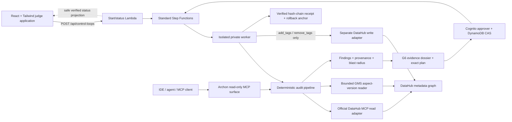

# Archon for DataHub

> **Audit the catalog itself.** Archon is an evidence-first governance agent that finds
> contradictions, lineage gaps, and control violations inside DataHub, explains their
> downstream impact, and permits one narrowly governed remediation only after an exact,
> expiring human approval.

Built for [DataHub: The Agent Hackathon](https://datahub.devpost.com/).

## What Archon does

Most catalog assistants retrieve metadata. Archon tests whether the catalog is internally
consistent:

- **Cross-source contradictions** — retained aspect versions disagree about ownership,
  schema, domain, or deprecation. Archon distinguishes a stable ingestion source
  (`pipelineName`) from an execution (`runId`), so two runs of one pipeline never become a
  fabricated conflict.
- **Lineage gaps and blast radius** — a missing upstream or risky asset is expanded into a
  bounded, cycle-safe downstream impact graph.
- **Governance controls G1–G6** — deterministic checks find missing ownership, domains,
  descriptions, typing, and sensitive-field classification.
- **Evidence, not opaque advice** — every result can be exported as JSON, Markdown, or
  SARIF and carries provenance, policy, and content digests.
- **Governed G6 remediation** — only a missing classification tag can become an action.
  Contradictions and G1–G5 remain manual-only. The browser sends only a decision and
  optional comment; it never sends a tool name, entity URN, or mutation arguments.

The judge-facing audit APIs are publicly usable only through CloudFront. A generated,
KMS-encrypted origin credential is never delivered to the browser: CloudFront overwrites
`x-api-key`, and API Gateway requires it on every method. The HTTP proxy replaces it with
a static redacted value, while the Lambda custom integrations construct narrow events
that contain no request headers at all. Direct API Gateway bypass therefore fails closed.
The SPA starts the durable path with `POST /api/control-loops` and polls a random
256-bit capability URL; the status projection never exposes a Step Functions ARN,
workflow input/output, task token, identity, or provider error. The legacy
`POST /api/audits` route remains an explicitly synchronous, read-only, one-dataset
diagnostic preview with a 25-second pipeline deadline. A separately deployed worker is
the only component that may
receive a distinct write credential. Its action catalog is limited to the official
`add_tags` / `remove_tags` tools, one entity, one column, and one policy tag.

## Why DataHub

DataHub is not an application database or object store. It is the metadata context graph
and governance control plane across databases, warehouses, BI, ML, and pipelines.

| Product category | What it owns | Relationship to Archon |
| --- | --- | --- |
| DataHub | Cross-platform metadata graph, lineage, governance, MCP context | Archon audits and safely acts on this control plane |
| AWS Glue / DataZone, Microsoft Purview, Google Dataplex, Alibaba metadata services | Cloud-vendor catalog/governance planes | Alternatives when the estate is concentrated in one cloud |
| CockroachDB | Transactional SQL data | A governed data source, not a catalog substitute |
| Backblaze B2 / S3 | Object storage | Evidence or dataset storage, not a metadata graph |
| Qwen / OpenAI / Gemini | Model inference | Optional narration/reasoning providers, not catalog systems |

The concise positioning is: **DataHub catalogs the data estate; Archon audits the
catalog itself.**

## System design



Important trust boundaries:

- DataHub MCP supplies the supported read tools. A complementary direct GMS read recovers
  retained aspect history because the current MCP view is latest-write-wins.
- Cross-source contradictions cannot fire from the MCP read tools alone: they require the
  bounded direct GMS version-history recovery path and distinct stable pipeline identities.
- Unknown or unstable provenance fails closed. It may produce a drift candidate, never a
  confirmed cross-source contradiction.
- The approval service has no DataHub or LLM secrets. It rehydrates server-owned state by
  `approvalId` and releases only a server-held callback token.
- The control service has no DataHub, write, or LLM secret. It may start/describe only this
  workflow and read only the audit/execution evidence prefixes. For governed terminal
  success it accepts only the expected remediation-result contract, re-verifies the
  content-addressed execution evidence and receipt chain, and returns outcome, evidence
  digests, completion time, and check counts—not raw orchestration output, identities,
  mutation responses, or provider errors. The opaque audit id is the unguessable browser
  polling capability.
- Write and rollback each require their own fresh, digest-bound approval. Approval is
  one-use and execution is idempotent. The immutable approval deadline is stored separately
  from DynamoDB TTL; a decided row is retained for 90 days so terminal proof remains
  independently verifiable.
- `dist/audit-worker.js`, the secretless approval-handoff Lambda, and
  `dist/remediation-worker.js` are independent capabilities. Only the first receives
  read/LLM credentials; only the last receives the write credential; the write worker
  and its IAM role cannot read the approval-token table. Callback poison is quarantined,
  evidence is append-only, and rejection also produces a durable execution receipt.
- `WorkerDesiredCount` still defaults to `0` and may be promoted to `1` only after CI has
  built and tested the exact image and the environment supplies distinct read/write
  credentials plus separate hosted read/write MCP endpoints. No deployed worker is claimed
  until that release workflow succeeds.

More detail: [design](docs/DESIGN.md), [DataHub integration research](docs/DATAHUB_RESEARCH.md),
and [evidence-based readiness](docs/READINESS.md).

## Run locally without external services

Node.js 22.15 or newer is recommended.

```bash
npm ci --ignore-scripts
npm run typecheck
npm run build
npm test
npm run coverage
npm run test:security
npm run load
npm run audit:demo
npm start
```

With no DataHub or model credentials, Archon uses deterministic fixtures. This mode is for
development and reproducible CI evidence; the UI labels fallback showcase data rather than
presenting it as a live tenant result.

The React application is an independent locked package:

```bash
npm ci --prefix web --ignore-scripts
npm --prefix web run typecheck
npm --prefix web test
npm --prefix web run build
```

Generated `dist/`, `coverage/`, `cdk.out/`, `readiness.json`, dependency directories, and
test reports are ignored and must not be committed.

## Connect a real DataHub

Use a sanitized demo tenant and a least-privilege read token.

```bash
DATAHUB_GMS_URL=https://datahub.example.test
DATAHUB_GMS_TOKEN=...
DATAHUB_MCP_URL=https://datahub.example.test/integrations/ai/mcp/
```

Archon supports two MCP transports:

- **Hosted Streamable HTTP** — set `DATAHUB_MCP_URL`. This is required by the hardened AWS
  container because it intentionally contains no Python/`uvx` runtime.
- **Pinned stdio development path** — leave `DATAHUB_MCP_URL` unset and install `uv`.
  Archon launches the pinned `mcp-server-datahub@0.6.0`, never `@latest`.

Aspect-version contradiction proof additionally requires:

1. retained aspect versions (`v0` plus at least one historical version);
2. two genuinely distinct stable pipeline identities;
3. a planted, sanitized conflict; and
4. the credentialed `Live DataHub proof` GitHub Actions workflow.

The live proof fails on auth, server, network, pagination-bound, retention, or provenance
uncertainty. Only the expected “no next retained version” response terminates history
enumeration normally.

One pipeline run creates one fresh harvest bundle: its snapshot and fact stream derive from
the same `search → get_entities → lineage` result, and version history reuses that exact URN
set. Live search fails before hydration when its declared total exceeds the execution
ceiling; every requested entity must be returned exactly once without a per-URN error; and
lineage must return a complete, count-consistent upstream envelope. MCP `isError` responses
are failures, never data. Every aspect history must terminate normally within its version
bound, and a live hosted audit refuses MCP-only configuration without direct GMS history
capability. The public preview
allows one URN and two retained versions with an 18-second harvest deadline. The durable
worker allows at most 25 URNs and 12 retained versions, uses controlled eight-way
concurrency, and has a 75-minute harvest / 90-minute pipeline budget inside its two-hour
callback. A broad request is rejected, never converted into an incomplete actionable plan.

## Governed remediation contract

The versioned policy is [policies/archon-remediation.v1.json](policies/archon-remediation.v1.json).
An actionable result must satisfy all of these conditions:

1. the finding is exactly G6 and has one unambiguous target;
2. the trusted policy allows that dataset prefix and classification tag;
3. dossier, policy, action catalog, before-state, and plan digests verify;
4. an authenticated `DataSteward` approves the exact unexpired plan;
5. the execution journal claims the approval once;
6. a fresh pre-state still matches the approved state;
7. the isolated mutation client invokes the exact official tag tool;
8. read-after-write verification proves the intended postcondition and no unexpected tag;
9. a content-addressed receipt records the event chain and a separately approvable rollback.

Anything ambiguous, stale, unsupported, replayed, or indeterminate fails closed.

## Hosted AWS reference architecture

[infra/aws](infra/aws) contains the deployment-grade reference:

- a self-contained `Archon-<stage>-Edge` stack in `us-east-1` that requests and
  DNS-validates the environment's ACM certificate, creates a CloudFront-scope WAF with
  encrypted retained logs, and hands both ARNs to the regional platform deployment;
- private, versioned, KMS-encrypted S3 SPA behind CloudFront OAC and Route 53 dual-stack
  aliases, with `TLSv1.3_2025`, CloudFront access logging, and S3 server-access logging;
- same-origin API Gateway with its own regional WAF, throttling, strict schemas, access
  logs, active X-Ray, and a two-second encrypted cache limited to the capability-scoped
  status GET;
- private ECS Fargate API/worker services behind an internal NLB and VPC Link;
- separate read/write/LLM secrets, KMS keys, IAM roles, and default-deny security groups;
  Fargate never receives a public IP, public subnets disable automatic public-IP
  assignment, and HTTPS egress is limited to AWS service or customer-managed prefix lists;
- Cognito Hosted UI with browser PKCE S256, an `archon/approve`-scoped approval
  Lambda, DynamoDB conditional state, Standard Step Functions, encrypted
  SQS/DLQs, and an Object-Lock evidence bucket;
- a deployment-generated `/runtime-config.json` that binds the immutable SPA to
  each environment without rebuilding it and is served no-store through a
  CloudFront caching-disabled behavior;
- a strict three-callback async route: audit evidence, durable human-approval handoff, then
  approved G6 execution; approval alone can never be mistaken for a completed write;
- a least-privilege control Lambda for public durable start/status, with immutable-evidence
  and receipt-chain verification plus a sanitized terminal proof panel, with no exposure
  of callback tokens or raw orchestration data;
- alarms, dashboards, retained encrypted logs, VPC flow logs, and private AWS endpoints.

The deployment workflow accepts only a **successful default-branch CI run ID** and its
matching full commit SHA. It verifies GitHub's artifact envelope digests plus the inner
container, deterministic SPA archive, and deterministic Lambda archive digests, deploys
the `us-east-1` edge stack before the regional platform stack, passes the edge certificate
and CloudFront WAF outputs into that platform deployment, deploys staging via GitHub OIDC,
runs security/smoke contracts, then waits at the protected `production` environment before
promoting those same three immutable artifacts. Selecting an older retained CI run is the
rollback path; no application artifact is rebuilt during deploy.
Infrastructure is deliberately reconciled from the current default-branch deployment
control plane only after that exact commit has successful CI, CodeQL, and workflow-security
push runs. An application rollback therefore cannot silently roll back newer IaC security
controls.

AWS deployment is user-gated until environment roles, URLs, secrets, per-environment
DNS names, owning Route 53 public hosted zones, customer-managed prefix lists for the
external DataHub read, DataHub write, and LLM endpoints, and a narrow
`DATAHUB_DEMO_QUERY` that resolves to exactly one dataset exist. The edge stack owns ACM
issuance and DNS validation; operators do not pre-provision a CloudFront certificate.
The target AWS account must be CDK-bootstrapped in both the workload region and
`us-east-1` before the edge-first deployment can run.
The deployment pipeline resolves the regional AWS-managed S3 and DynamoDB prefix-list IDs
itself and keeps them distinct from those three external allowlists. Staging and production
smoke evidence bind the query digest and reject `{}` / wildcard catalog sweeps. Each
deployment receipt also embeds validated edge-security, regional-WAF, and network-egress
contracts, including the exact ACM/WAF identities, KMS-encrypted retained WAF log groups,
sampled-data protection, five-minute rate windows, exact enabled/rotating customer KMS
keys, CDK-output digest, prefix-list identities, versions and entry digests, plus the
exact live active IPv4 NLB/workload security-group rules. Source code does not imply that
a public endpoint has already been deployed.

## Pipeline-only security and CI/CD

Every security claim must be reproduced by GitHub Actions; workstation or manual scanner
output is not accepted as release evidence:

| Gate | CI/CD evidence |
| --- | --- |
| Secret detection | Checksum-pinned Gitleaks |
| SAST | CodeQL security-and-quality queries |
| Application abuse cases | AuthZ/tool-boundary, prompt-injection, provenance injection, data-exposure, and remediation-boundary tests |
| Dependency security | Root, web, infra, approval-Lambda, and control-Lambda `npm audit`; PR dependency review; Dependabot |
| IaC preventive policy | Unit-tested, project-owned CloudFormation Guard rules against synthesized templates |
| IaC scanner | Trivy config scan with an all-severity, zero-finding fail gate plus structurally validated SARIF |
| Container hardening | Non-root/read-only runtime contract and isolated health boot |
| Supply chain | Exact CI container/SPA/Lambda subjects, non-vacuous Syft SPDX/CycloneDX SBOMs, Grype gates with a required fresh (≤24h), hash-validated DB whose retrieval time and exact file manifest are sealed in a v4 attestation, trusted-main SARIF, and daily or exact-run rescans |
| Workflow security | actionlint plus zizmor audits for workflow correctness, dangerous triggers, permissions, and unpinned dependencies |
| Hosted DAST | Digest-pinned OWASP ZAP baseline against staging, with Medium/High findings as a hard gate and retained JSON/HTML/Markdown evidence |
| Deployment security | OIDC short-lived AWS credentials, account allow-list, ECR scan, immutable digest promotion, versioned secret refresh, exact no-store auth runtime-config proof, negative AuthZ/schema checks, TLS/security-header checks, and digest-bound IaC/edge/regional-WAF/network contracts |

Workflows:

- [CI](.github/workflows/ci.yml) — root, web, AWS CDK, policy, security, load, staged
  DataHub Skill contribution, and immutable artifact gates.
- [CodeQL](.github/workflows/codeql.yml) — SAST on pull requests, `master`, and schedule.
- [Workflow security](.github/workflows/workflow-security.yml) — actionlint and zizmor
  validation of the workflows themselves.
- [Production supply chain](.github/workflows/supply-chain.yml) — automatic, daily, and
  exact-run rescans of the original CI container, SPA, and Lambda bytes; fresh-DB
  vulnerability gates, SARIF, and v4 attestations.
- [Deploy immutable AWS release](.github/workflows/deploy.yml) — staging verification and
  a ≤24-hour v4 supply-chain-attestation gate plus digest-pinned OWASP ZAP DAST, then
  protected same-artifact production promotion.
- [Live DataHub proof](.github/workflows/live-datahub-proof.yml) — credentialed proof of the
  flagship retained-history path.
- [Governed DataHub canary](.github/workflows/governed-canary.yml) — protected
  `GOVERNED → AWAITING_APPROVAL`, a human gate displaying the sealed plan/recovery
  digests, then `APPROVE → VERIFIED`, followed by a separately approved exact rollback
  and read-after-rollback proof. Its isolation contract is in
  [docs/GOVERNED_CANARY.md](docs/GOVERNED_CANARY.md).
- [Independent canary recovery](.github/workflows/governed-canary-recovery.yml) —
  exact-parent `workflow_run` compensation for failed or cancelled canaries.

CI also enforces an intentionally offline core-path SLO through `load/audit.js`: ten
concurrent virtual users complete 200 deterministic pipeline/MCP iterations with zero
errors, no dropped work, and audit p95 latency at or below the default 1,500 ms budget.
This is a reproducible regression gate for Archon's core audit path, not a claim about
hosted DataHub or internet latency.

Action dependencies are commit-SHA pinned. A workflow definition is not called “green”
until its remote run succeeds, and a deployment definition is not called “deployed” until
the hosted smoke evidence exists.

## Current delivery status

The repository contains the application, UI, security boundaries, locked packages,
reference infrastructure, and CI/CD definitions. The authoritative remaining proof matrix
is [docs/READINESS.md](docs/READINESS.md). In particular:

- remote CI/CodeQL/supply-chain evidence must be generated for the current branch;
- GitHub `staging`, `production`, `datahub-demo`, `governed-canary`,
  `governed-canary-rollback`, and `governed-canary-recovery` environments and `master`
  protection must be configured;
- AWS OIDC, CDK bootstrap, DataHub/model credentials, and a hosted deployment are
  user-gated;
- a real retained-history contradiction and governed canary write/rollback need sanitized
  evidence;
- screenshots, the under-three-minute public video, Devpost copy, and optional public post
  are intentionally last.

## Prior-work disclosure

This is a new Apache-2.0 project. It reuses selected code patterns from our earlier agents
while adding a new DataHub client/domain layer, temporal provenance semantics, blast-radius
analysis, governed remediation contracts, UI, HTTP boundary, and AWS architecture. The
file-level disclosure is in [NOTICE.md](NOTICE.md).

## License

[Apache License 2.0](LICENSE).
