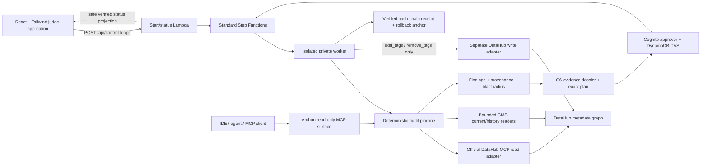

# Archon for DataHub

> **Audit the catalog itself.** Archon is an evidence-first governance agent that finds
> contradictions, lineage gaps, and control violations inside DataHub, explains their
> downstream impact, and permits one narrowly governed remediation only after an exact,
> expiring human approval.

Built for [DataHub: The Agent Hackathon](https://datahub.devpost.com/).

## What Archon does

Most catalog assistants retrieve metadata. Archon tests whether the catalog is internally
consistent:

- **Cross-source contradictions** — retained aspect versions disagree about ownership,
  schema, domain, or deprecation. Archon distinguishes a stable ingestion source
  (`pipelineName`) from an execution (`runId`), so two runs of one pipeline never become a
  fabricated conflict.
- **Lineage gaps and blast radius** — declared current `upstreamLineage` is reconciled
  against resolved MCP topology, and a missing upstream or risky asset is expanded into a
  bounded, cycle-safe downstream impact graph without treating query scope as absence.
- **Governance controls G1–G6** — deterministic checks find missing ownership, domains,
  descriptions, typing, and sensitive-field classification. G6 accepts only exact
  policy identifiers; an unrelated tag or glossary term never passes the control.
- **Evidence, not opaque advice** — every result can be exported as JSON, Markdown, or
  SARIF and carries provenance, policy, and content digests. Model-runtime provenance is
  a strict union: deterministic fixture runs state that no provider model call occurred;
  live runs retain only bounded provider/model/response-ID, token-usage, and client-latency
  metadata. Prompts, credentials, endpoints, raw errors, and provider payloads are never
  admitted to that contract.
- **Governed G6 remediation** — only a missing classification tag can become an action.
  Contradictions and G1–G5 remain manual-only. The browser sends only a decision and
  optional comment; it never sends a tool name, entity URN, or mutation arguments.

The judge-facing audit APIs are publicly usable only through CloudFront. A generated,
KMS-encrypted origin credential is never delivered to the browser: CloudFront overwrites
`x-api-key`, and API Gateway requires it on every method. The HTTP proxy replaces it with
a static redacted value, while the Lambda custom integrations construct narrow events
that contain no request headers at all. Direct API Gateway bypass therefore fails closed.
The SPA starts the durable path with `POST /api/control-loops` and polls a random
256-bit capability URL; the status projection never exposes a Step Functions ARN,
workflow input/output, task token, identity, or provider error. The legacy
`POST /api/audits` route remains an explicitly synchronous, read-only, one-dataset
diagnostic preview with a 25-second pipeline deadline. A separately deployed worker is
the only component that may
receive a distinct write credential. Its action catalog is limited to the official
`add_tags` / `remove_tags` tools, one entity, one column, and one policy tag.

The environment supplies one exact `DemoQuery` to the SPA, HTTP service, control Lambda,
and public Archon MCP server; a missing scope, padded equivalents, wildcards, alternate
catalog queries, and a query resolving to anything other than one dataset fail closed. MCP
`get_entity` accepts only the URN resolved from that scope and rebuilds a six-field public
identity projection; descriptions, owners, schema fields, tags, glossary terms, domains,
lineage, source metadata, and arbitrary aspects never cross that boundary. Public audit
responses are likewise newly constructed allowlisted projections rather than the immutable
internal evidence object: arbitrary rich detail and raw contradiction values are excluded,
provenance drops actor/value fields, and the complete response is recursively rejected if
it contains forbidden or credential-shaped fields. A shared conformance corpus keeps the
backend, Lambda, browser, evidence exporter, and deployment validator aligned in CI.

## Why DataHub

DataHub is not an application database or object store. It is the metadata context graph
and governance control plane across databases, warehouses, BI, ML, and pipelines.

| Product category | What it owns | Relationship to Archon |
| --- | --- | --- |
| DataHub | Cross-platform metadata graph, lineage, governance, MCP context | Archon audits and safely acts on this control plane |
| AWS Glue / DataZone, Microsoft Purview, Google Dataplex, Alibaba metadata services | Cloud-vendor catalog/governance planes | Alternatives when the estate is concentrated in one cloud |
| CockroachDB | Transactional SQL data | A governed data source, not a catalog substitute |
| Backblaze B2 / S3 | Object storage | Evidence or dataset storage, not a metadata graph |
| Qwen / OpenAI / Gemini | Model inference | Optional narration/reasoning providers, not catalog systems |

The concise positioning is: **DataHub catalogs the data estate; Archon audits the
catalog itself.**

## System design


```mermaid
flowchart LR
  UI["React + Tailwind judge application"] -->|POST /api/control-loops| CONTROL["Start/status Lambda"]
  CONTROL --> SFN["Standard Step Functions"]
  SFN --> WORKER["Isolated private worker"]
  CONTROL -. safe verified status projection .-> UI
  IDE["IDE / agent / MCP client"] --> AMCP["Archon read-only MCP surface"]
  WORKER --> PIPE["Deterministic audit pipeline"]
  AMCP --> PIPE
  PIPE --> READ["Official DataHub MCP read adapter"]
  PIPE --> GMSREAD["Bounded GMS current/history readers"]
  READ --> DH["DataHub metadata graph"]
  GMSREAD --> DH
  PIPE --> FIND["Findings + provenance + blast radius"]
  FIND --> DOSSIER["G6 evidence dossier + exact plan"]
  DOSSIER --> APPROVAL["Cognito approver + DynamoDB CAS"]
  APPROVAL --> SFN
  WORKER -->|add_tags / remove_tags only| WRITE["Separate DataHub write adapter"]
  WRITE --> DH
  WORKER --> RECEIPT["Verified hash-chain receipt + rollback anchor"]
```

Important trust boundaries:

- DataHub MCP supplies supported discovery, entity, schema-completion, and resolved-topology
  reads. Complementary bounded direct GMS reads recover declared current lineage (including
  dangling URNs) and retained aspect history hidden by the latest-write-wins MCP view.
- Cross-source contradictions cannot fire from the MCP read tools alone: they require the
  bounded direct GMS version-history recovery path and distinct stable pipeline identities.
- Unknown or unstable provenance fails closed. It may produce a drift candidate, never a
  confirmed cross-source contradiction.
- The model is not an authority for governance state or mutations. Classifier, lineage,
  G1–G6, blast-radius, dossier, and exact mutation arguments remain deterministic. The
  optional narrator receives those completed results and returns bounded prose plus
  fail-closed `archon.model-runtime-provenance/v1` metadata.
- The approval service has no DataHub or LLM secrets. It rehydrates server-owned state by
  `approvalId` and releases only a server-held callback token.
- The control service has no DataHub, write, or LLM secret. It may start/describe only this
  workflow and read only the audit/execution evidence prefixes. For governed terminal
  success it accepts only the expected remediation-result contract, re-verifies the
  content-addressed execution evidence and receipt chain, and returns outcome, evidence
  digests, completion time, and check counts—not raw orchestration output, identities,
  mutation responses, or provider errors. The opaque audit id is the unguessable browser
  polling capability.
- Write and rollback each require their own fresh, digest-bound approval. Approval is
  one-use and execution is idempotent. The immutable approval deadline is stored separately
  from DynamoDB TTL; a decided row is retained for 90 days so terminal proof remains
  independently verifiable.
- `dist/audit-worker.js`, the secretless approval-handoff Lambda, and
  `dist/remediation-worker.js` are independent capabilities. Only the first receives
  read/LLM credentials; only the last receives the write credential; the write worker
  and its IAM role cannot read the approval-token table. Callback poison is quarantined,
  evidence is append-only, and rejection also produces a durable execution receipt.
- `WorkerDesiredCount` still defaults to `0` and may be promoted to `1` only after CI has
  built and tested the exact image and the environment supplies distinct read/write
  credentials plus separate hosted read/write MCP endpoints. No deployed worker is claimed
  until that release workflow succeeds.

More detail: [design](docs/DESIGN.md), [DataHub integration research](docs/DATAHUB_RESEARCH.md),
[temporal-provenance benchmark](docs/BENCHMARK.md), [judge evidence
pack](docs/JUDGE_EVIDENCE.md), [judge testing guide](docs/JUDGE_TESTING.md),
[attested submission judge pack](docs/SUBMISSION_JUDGE_PACK.md),
[production availability](docs/AVAILABILITY.md), [production paging delivery
proof](docs/PRODUCTION_PAGING_TEST.md), and [protected judge
access](docs/JUDGE_ACCESS.md), [final submission content
review](docs/SUBMISSION_CONTENT_REVIEW.md), [post-submit Devpost
confirmation](docs/SUBMISSION_DEVPOST_CONFIRMATION.md), plus [evidence-based
readiness](docs/READINESS.md), the [merged-upstream OSS bonus evidence
contract](docs/SUBMISSION_BONUS_OSS.md), and the [privacy-preserving optional
feedback evidence contract](docs/SUBMISSION_BONUS_FEEDBACK.md).

## Run locally without external services

Node.js 22.15 or newer is recommended.

```bash
npm ci --ignore-scripts
npm run typecheck
npm run build
npm test
npm run coverage
npm run test:security
npm run load
npm run audit:demo
npm start
```

With no DataHub or model credentials, Archon uses deterministic fixtures. This mode is for
development and reproducible CI evidence; the UI labels fallback showcase data rather than
presenting it as a live tenant result.

The React application is an independent locked package:

```bash
npm ci --prefix web --ignore-scripts
npm --prefix web run typecheck
npm --prefix web test
npm --prefix web run test:coverage
npm --prefix web run coverage:critical
npm --prefix web run build
```

Generated `dist/`, `coverage/`, `cdk.out/`, `readiness.json`, dependency directories, and
test reports are ignored and must not be committed.

The ordinary CI web job additionally installs the exact Playwright Chromium revision in
the ephemeral runner, serves the already-built SPA through Vite preview, and exercises the
fixture judge journey on desktop Chrome, Pixel 7, and a 320×568 viewport. The journey keeps
production authentication fail-closed, proves that passive orientation and fixture approval
emit no API or external request, checks keyboard/overflow behavior, and rejects critical or
serious WCAG A/AA Axe findings. Coverage HTML/LCOV/JSON, Playwright HTML, screenshots, traces,
and structured authority/accessibility receipts are retained only as CI artifacts.

## Judge-ready evidence without hand-authored outputs

CI generates three complementary, explicitly labeled evidence products:

- a frozen seven-case DataHub capability benchmark that measures a latest-write-wins
  current-view boundary against Archon's retained-history path, including negative cases
  for same-pipeline drift, unknown provenance, source agreement, and a single write;
- a deterministic synthetic judge pack produced by the real audit, G6 planning, approval,
  execution-verification, receipt, rollback, JSON, Markdown, and SARIF functions; and
- a browser-rendered fixture journey with desktop/mobile screenshots, responsive and
  keyboard checks, Axe evidence, and a zero-mutation-authority request receipt.

These are replayed or contract-checked in CI and retained for 90 days; the benchmark and
synthetic judge-pack artifact digests are checksum-sealed and bound into the default-branch
release attestation.
The browser also offers an on-demand, exactly allowlisted application projection with
WebCrypto self-consistency checks and an optional, passive three-step judge tour. It does
not claim origin authenticity; the attested CI artifact is the external provenance path.
Synthetic packs are never presented as live DataHub or deployment proof.

The primary OSS bonus candidate is a bounded, read-only
[`get_aspect_history` tool](contrib/mcp-get-aspect-history/) for the official DataHub MCP
server. CI applies its exact source, tests, and registration patch to a pinned upstream
revision before running upstream lint, type, and focused test contracts. It remains
explicitly “staged, not submitted” until a real public upstream PR exists. The
source-complete bonus evidence workflow intentionally remains blocked until that exact
candidate is merged by an independent upstream maintainer.

## Connect a real DataHub

Use a sanitized demo tenant and a least-privilege read token.

```bash
DATAHUB_GMS_URL=https://datahub.example.test
DATAHUB_GMS_TOKEN=...
DATAHUB_MCP_URL=https://datahub.example.test/integrations/ai/mcp/
ARCHON_DEMO_QUERY=domain:Commerce
```

`ARCHON_DEMO_QUERY` must already be trimmed, contain no wildcard, and resolve to exactly
one dataset. It is the only query admitted by the public HTTP and Archon MCP catalog tools.

Archon supports two MCP transports:

- **Hosted Streamable HTTP** — set `DATAHUB_MCP_URL`. This is required by the hardened AWS
  container because it intentionally contains no Python/`uvx` runtime.
- **Pinned stdio development path** — leave `DATAHUB_MCP_URL` unset and install `uv`.
  Archon launches the pinned `mcp-server-datahub@0.6.0`, never `@latest`.

Aspect-version contradiction proof additionally requires:

1. retained aspect versions (`v0` plus at least one historical version);
2. two genuinely distinct stable pipeline identities;
3. a planted, sanitized conflict; and
4. the credentialed `Live DataHub proof` GitHub Actions workflow.

The live proof fails on auth, server, network, pagination-bound, retention, or provenance
uncertainty. Only the expected “no next retained version” response terminates history
enumeration normally.

One pipeline run creates one fresh harvest bundle: its snapshot and fact stream derive from
the same narrow search roots. Exact entity hydration, full-schema completion, bidirectional
MCP topology, current declared-lineage reconciliation, and retained history share that URN
set and run under one deadline. Topology neighbors remain context and never expand the
governance/history audit scope. Live search fails before hydration when its declared total
exceeds the execution ceiling; every requested entity must be returned exactly once without
a per-URN error; schema and lineage totals must remain complete and within policy. MCP
`isError` responses are failures, never data. Every aspect history must terminate normally
within its version bound, and a live hosted audit refuses MCP-only configuration without
direct GMS history/current-lineage capability. The public preview
allows one URN and two retained versions with an 18-second harvest deadline. The durable
worker allows at most 25 URNs and 12 retained versions, uses controlled eight-way
concurrency, and has a 75-minute harvest / 90-minute pipeline budget inside its two-hour
callback. A broad request is rejected, never converted into an incomplete actionable plan.

## Governed remediation contract

The versioned policy is [policies/archon-remediation.v1.json](policies/archon-remediation.v1.json).
An actionable result must satisfy all of these conditions:

1. the finding is exactly G6 and has one unambiguous target;
2. the trusted policy allows that dataset prefix and classification tag;
3. dossier, policy, action catalog, before-state, and plan digests verify;
4. an authenticated `DataSteward` approves the exact unexpired plan;
5. the execution journal claims the approval once;
6. a fresh pre-state still matches the approved state;
7. the isolated mutation client invokes the exact official tag tool;
8. read-after-write verification proves the intended postcondition and no unexpected tag;
9. a content-addressed receipt records the event chain and a separately approvable rollback.

Anything ambiguous, stale, unsupported, replayed, or indeterminate fails closed.

## Hosted AWS reference architecture

[infra/aws](infra/aws) contains the deployment-grade reference:

- a self-contained `Archon-<stage>-Edge` stack in `us-east-1` that requests and
  DNS-validates the environment's ACM certificate, creates a CloudFront-scope WAF with
  encrypted retained logs, and hands both ARNs to the regional platform deployment;
- private, versioned, KMS-encrypted S3 SPA behind CloudFront OAC and Route 53 dual-stack
  aliases, with `TLSv1.3_2025`, CloudFront access logging, and S3 server-access logging;
- same-origin API Gateway and the exact Cognito user pool bound to one regional WAF,
  with throttling, strict schemas, access logs, active X-Ray, and a two-second encrypted
  cache limited to the capability-scoped status GET;
- private ECS Fargate API/worker services behind an internal NLB and VPC Link;
- separate read/write/LLM secrets, KMS keys, IAM roles, and default-deny security groups;
  Fargate never receives a public IP, public subnets disable automatic public-IP
  assignment, and HTTPS egress is limited to AWS service or customer-managed prefix lists;
- Cognito Hosted UI with browser PKCE S256, an `archon/approve`-scoped approval
  Lambda, DynamoDB conditional state, Standard Step Functions, encrypted
  SQS/DLQs, and an Object-Lock evidence bucket;
- a deployment-generated `/runtime-config.json` that binds the immutable SPA to
  each environment without rebuilding it, carries the exact narrow hosted-demo query,
  and is served no-store through a CloudFront caching-disabled behavior;
- a strict three-callback async route: audit evidence, durable human-approval handoff, then
  approved G6 execution; approval alone can never be mistaken for a completed write;
- a least-privilege control Lambda for public durable start/status, with immutable-evidence
  and receipt-chain verification plus a sanitized terminal proof panel, with no exposure
  of callback tokens or raw orchestration data;
- alarms, dashboards, retained encrypted logs, VPC flow logs, and private AWS endpoints;
  the production alarm topic records 100% of HTTP/S success feedback plus failures through
  one least-privilege SNS role into one dedicated KMS-encrypted retained log group.

The deployment workflow requires a **successful default-branch CI run ID**, its matching
full commit SHA, and the exact run ID, run attempt, artifact ID, artifact digest, and inner
receipt SHA-256 of a successful protected DataHub demo-state run for that release. It
verifies GitHub's artifact envelope digests plus the inner
container, deterministic SPA archive, and deterministic Lambda archive digests, deploys
the `us-east-1` edge stack before the regional platform stack, passes the edge certificate
and CloudFront WAF outputs into that platform deployment, deploys staging via GitHub OIDC,
runs security/smoke contracts, then waits at the protected `production` environment before
promoting those same three immutable artifacts. Selecting an older retained CI run is the
rollback path; no application artifact is rebuilt during deploy.
Infrastructure is deliberately reconciled from the current default-branch deployment
control plane only after that exact commit has successful CI, CodeQL, and workflow-security
push runs. The workflow revalidates the default-branch ref and latest exact-SHA receipts
after production approval, immediately before each AWS OIDC trust boundary, and immediately
before the first staging and production mutations. After observing the exact live production
bytes, it reproduces the original receipt digest once more immediately before sealing
promotion evidence; the canonical receipt is retained in that evidence. An application
rollback therefore cannot silently roll back newer IaC security controls, and a mid-promotion
branch or gate change cannot produce a trusted successful deployment record.
Staging and production independently re-download, checksum, canonically validate, and
attestation-verify the exact `datahub-demo-receipt-<run>-<attempt>` artifact. Each
environment fingerprints its configured DataHub read endpoint without retaining the URL
or token and requires equality with the sealed seed endpoint.

Manual dispatch has two explicit modes. `staging-bootstrap` performs the same immutable
source and control-plane gates, deploys and verifies staging, then stops before the governed
canary and production. It prepares a secretless, checksum-sealed three-file handoff:
`staging-bootstrap-manifest.json`, `attestation-predicate.json`, and `SHA256SUMS`. The
manifest binds the release, deployment control plane, run, staging evidence, account,
region, stack, image, application URL, evidence bucket, Cognito client ID, and Cognito
Hosted UI origin; the workflow attests that inventory, reverifies it, and retains it for
90 days. `promote` redeploys/verifies staging from the selected immutable release, requires
the exact governed write/rollback canary, and only then enters the protected production
promotion. For a clean account, first configure and run the staging prerequisites in
`staging-bootstrap`, verify its attestation, configure the four emitted
`CANARY_*` non-secret values plus the separately protected canary credentials and reviewer
rules, and then run `promote`. The handoff never contains or replaces AWS, DataHub, model,
or reviewer credentials. These mode and handoff changes remain source-complete but are not
deployment-complete: their static/source contracts passed remote CI, while neither
`staging-bootstrap` nor `promote` has been dispatched against AWS.

AWS deployment is user-gated until environment roles, URLs, secrets, per-environment
DNS names, owning Route 53 public hosted zones, customer-managed prefix lists for the
external DataHub read, DataHub write, and LLM endpoints, and a narrow
`DATAHUB_DEMO_QUERY` that resolves to exactly one dataset exist. The edge stack owns ACM
issuance and DNS validation; operators do not pre-provision a CloudFront certificate.
The target AWS account must be CDK-bootstrapped in both the workload region and
`us-east-1` before the edge-first deployment can run.
The deployment pipeline resolves the regional AWS-managed S3 and DynamoDB prefix-list IDs
itself and keeps them distinct from those three external allowlists. Staging and production
smoke evidence bind the exact query and state digests and reject `{}` / wildcard catalog
sweeps. Smoke must reproduce exactly the G6 email gap, the dangling upstream plus
one-hop target blast-radius edge, and the two-source retained owner contradiction; the
sanitized semantic projection must be identical in staging and production. Each
SPA reads that same exact query from runtime config and pre-fills the audit scope, so the
judge path is one click while remaining bounded to the proven single dataset. Each
deployment receipt also embeds validated edge-security, regional-WAF, and network-egress
contracts, including the exact ACM/WAF identities, KMS-encrypted retained WAF log groups,
sampled-data protection, five-minute rate windows, exact enabled/rotating customer KMS
keys, CDK-output digest, prefix-list identities, versions and entry digests, plus the
exact live active IPv4 NLB/workload security-group rules. Source code does not imply that
a public endpoint has already been deployed.

## Pipeline-only security and CI/CD

Every security claim must be reproduced by GitHub Actions; workstation or manual scanner
output is not accepted as release evidence:

| Gate | CI/CD evidence |
| --- | --- |
| Secret detection | Checksum-pinned Gitleaks |
| SAST | CodeQL security-and-quality queries |
| Application abuse cases | AuthZ/tool-boundary, prompt-injection, provenance injection, data-exposure, and remediation-boundary tests |
| Browser quality | Exact-pinned Chromium fixture journey on desktop, Pixel 7, and 320×568; keyboard and zero-overflow contracts; serious/critical WCAG A/AA Axe gate; global and decision-critical web coverage ratchets |
| Dependency security | Root, web, approval-Lambda, and control-Lambda fail-closed `npm audit` with bounded registry-transport retries; exact override verification; infra-only checksum-pinned repair and receipt-bound exact-path audit compensation for the immutable `aws-cdk-lib` GHSA; PR dependency review; Dependabot |
| IaC preventive policy | Unit-tested, project-owned CloudFormation Guard rules against synthesized templates |
| IaC scanner | Trivy config scan with an all-severity, zero-finding fail gate plus structurally validated SARIF |
| Container hardening | Non-root/read-only runtime contract and isolated health boot |
| Supply chain | Exact CI container/SPA/Lambda subjects, non-vacuous Syft SPDX/CycloneDX SBOMs, Grype gates with a required fresh (≤24h), hash-validated DB whose retrieval time and exact file manifest are sealed in a v4 attestation, trusted-main SARIF, exact-run rescans, and a daily read-only-OIDC rescan transitively bound to current ECS image digests, Lambda ZIP/config/content digests, every versioned KMS-encrypted SPA object, exact deployment/CI artifacts, and a second post-scan live-byte TOCTOU observation |
| Workflow security | actionlint plus zizmor audits for workflow correctness, dangerous triggers, permissions, and unpinned dependencies |
| Hosted DAST | Digest-pinned OWASP ZAP baseline against staging, with Medium/High findings as a hard gate and retained JSON/HTML/Markdown evidence |
| Deployment security | OIDC short-lived AWS credentials, account allow-list, ECR scan, immutable digest promotion, versioned secret refresh, exact no-store auth runtime-config proof, negative AuthZ/schema checks, TLS/security-header checks, and digest-bound IaC/edge/network plus dual API-stage/Cognito regional-WAF contracts |
| Production availability | Six-hour read-only public-path probe with strict TLS/header/schema checks, exact CI/deployment/runtime-byte provenance, TOCTOU revalidation, and checksum-sealed 90-day evidence |
| External paging delivery | Protected, release-bound SNS publish correlated to one unique 2xx external HTTPS delivery-status record; no publish-only or human-acknowledgement claim |

Workflows:

- [CI](.github/workflows/ci.yml) — root, coverage-ratcheted web, Playwright/Axe
  desktop/mobile browser journey, AWS CDK, policy, security, load, benchmark, reproducible
  judge evidence, exact-upstream DataHub MCP contribution tests, and immutable artifact
  gates.
- [CodeQL](.github/workflows/codeql.yml) — JavaScript/TypeScript and Python SAST on pull
  requests, `master`, and schedule.
- [Workflow security](.github/workflows/workflow-security.yml) — actionlint and zizmor
  validation of the workflows themselves.
- [GitHub repository posture](.github/workflows/github-repository-posture.yml) —
  scheduled/manual, secretless observation using only the automatic `GITHUB_TOKEN`.
  This public tier verifies repository identity and merge/lifecycle settings, the public
  `master` protection signal, Apache-2.0 detection, private vulnerability reporting, the
  exact 15-environment inventory, administrator-bypass state, and exact `master`-only
  deployment policies. Detailed branch-protection rules, the Actions allowlist/SHA-pinning
  policy, and environment secret-name inventories remain explicitly
  `unverified-requires-administration-and-environments-read`: the elevated tier is
  deliberately unconfigured. Its future least-privilege boundary is
  `Actions:read`, `Administration:read`, `Environments:read`, and `Metadata:read`.
  A workstation `gh` token is never copied into CI.
- [Production supply chain](.github/workflows/supply-chain.yml) — automatic and exact-run
  rescans plus a daily rescan of the original CI container, SPA, and Lambda bytes for the
  exact successful deployment currently identified by `Archon-production`; it verifies
  the deployment-evidence artifact, GitHub artifact metadata digests, inner subject
  digests, and a canonical ECS/Lambda/S3 live-runtime manifest. It repeats the live AWS
  observation after scanning, revalidates the sealed observer whole-snapshot receipt before
  read-only OIDC and again immediately before provenance signing. Immediately before the
  first attestation it also reads the latest exact historical-source CodeQL and workflow-
  security receipts twice and requires both snapshots to equal the sealed receipt; the
  deployed source SHA may be older than the current `master`. The workflow produces
  fresh-DB gates, self-verifiable 90-day raw evidence, SARIF, and v4 attestations.
- [Production posture](.github/workflows/production-posture.yml) — scheduled/manual,
  read-only-OIDC termination-protection, CloudFormation drift, alarm-subscription, and
  TOCTOU verification for all three production stacks, with signed 90-day evidence.
- [Production availability](.github/workflows/availability.yml) — scheduled/manual,
  credentialless observation of the public UI, runtime config, and one bounded read-only
  audit, bound to the newest successful production promotion and exact runtime bytes.
- [Production paging delivery](.github/workflows/production-paging-test.yml) —
  twice weekly (`17 3 * * 1,4`) and manually dispatchable protected, release-bound SNS
  test whose returned message ID must remain bound to one unique external HTTPS 2xx
  delivery-status event across a delayed second complete lookup;
  retained evidence excludes the endpoint, payload, provider response, raw log event, and
  AWS identifiers. Its exact OIDC/IAM and evidence boundary is documented in
  [docs/PRODUCTION_PAGING_TEST.md](docs/PRODUCTION_PAGING_TEST.md).
- [Deploy immutable AWS release](.github/workflows/deploy.yml) — staging verification and
  a ≤24-hour v4 supply-chain-attestation gate plus digest-pinned OWASP ZAP DAST, then an
  exact-run governed write/rollback canary whose signed evidence is required before the
  protected same-artifact production promotion. Its checksum-sealed staging and production
  evidence use the `staging-deployment/v1` and `production-deployment/v1` predicates and
  retain the exact sanitized demo-state source binding.
- [Live DataHub proof](.github/workflows/live-datahub-proof.yml) — credentialed proof of the
  flagship retained-history path plus a fresh deployed G6/dangling-blast-radius proof,
  with matching pre-secret, post-proof, and immediate pre-attestation exact control-plane
  gates. Its `live-datahub-proof/v4` predicate binds the original seed run/artifact/
  attestation, endpoint fingerprint, deployment evidence, semantic projection, and both
  enforced and enriched control-plane receipts.
- [DataHub demo state](.github/workflows/datahub-demo-state.yml) — idempotent protected
  seed/reset of the commit- and SHA-256-bound official showcase baseline plus the exact
  retained-history contradiction, G6 email gap, and dangling lineage target. Its
  plan-before-mutation protocol and two-URN delete allowlist are documented in
  [docs/DEMO_DATA_STATE.md](docs/DEMO_DATA_STATE.md).
- [Cognito judge access](.github/workflows/judge-user.yml) — independently approved,
  stage- and target-bound provision, rotation, reactivation, and emergency deactivation
  of the single immutable judge identity, with no exported credential artifact. Only
  emergency deactivation can bypass red CI status; it still binds the exact current
  master workflow/run and recomputes its V3-sealed receipt before and after OIDC. The
  least-privilege operating contract is documented in
  [docs/JUDGE_ACCESS.md](docs/JUDGE_ACCESS.md).
- [Governed DataHub canary](.github/workflows/governed-canary.yml) — protected
  `GOVERNED → AWAITING_APPROVAL`, a human gate displaying the sealed plan/recovery
  digests, then `APPROVE → VERIFIED`, followed by a separately approved exact rollback
  and read-after-rollback proof. Its isolation contract is in
  [docs/GOVERNED_CANARY.md](docs/GOVERNED_CANARY.md).
- [Independent canary recovery](.github/workflows/governed-canary-recovery.yml) —
  exact-parent `workflow_run` compensation for failed or cancelled canaries.
- [Submission operations](.github/workflows/submission-operations.yml) —
  independently reconstructs SQ10 from exact attested availability, posture,
  paging, governed-canary, project-access, and live-DataHub runs, then retains
  and signs the nine-subject operational-readiness inventory.
- [Submission judge pack](.github/workflows/submission-judge-pack.yml) —
  converts the exact successful current-release CI judge artifact and its
  signed release predicate into the optional four-subject SQ9 evidence source,
  explicitly labeled as sanitized synthetic fixture evidence rather than live
  proof. Its operating contract is in
  [docs/SUBMISSION_JUDGE_PACK.md](docs/SUBMISSION_JUDGE_PACK.md).
- [Submission content review](.github/workflows/submission-content-review.yml) —
  protected independent review of the exact final Devpost copy, public
  under-three-minute video, complete repository history, prior-work/media
  disclosures, and cross-medium claims. It independently reconstructs SQ6,
  SQ7, and SQ8, retains 16 checksum-sealed subjects for 90 days, and verifies
  the persisted full-subject GitHub attestation. The fail-closed operating
  contract is in
  [docs/SUBMISSION_CONTENT_REVIEW.md](docs/SUBMISSION_CONTENT_REVIEW.md).
- [Devpost submission confirmation](.github/workflows/submission-devpost-confirmation.yml) —
  post-submit-only `SQ11` producer that independently revalidates the
  pre-submit readiness seal, protected reviewer approval, reviewed content,
  official rules, and all public judging URLs. It retains no Devpost
  credentials or private confirmation bytes and verifies all six signed
  subjects both against the returned bundle and through persisted lookup.
  Its non-circular operating sequence is in
  [docs/SUBMISSION_DEVPOST_CONFIRMATION.md](docs/SUBMISSION_DEVPOST_CONFIRMATION.md).
- [Submission bonus OSS](.github/workflows/submission-bonus-oss.yml) —
  intentionally accepts only a public merged PR for the exact four-path
  `get_aspect_history` candidate. It reconstructs the complete PR head tree
  from the immutable CI receipt and pinned upstream base, compares merged path
  modes and bytes, verifies the signed CI release predicate, retains four
  checksum-sealed subjects, and verifies the persisted full-subject
  attestation. Its activation sequence and fail-closed contract are in
  [docs/SUBMISSION_BONUS_OSS.md](docs/SUBMISSION_BONUS_OSS.md).
- [Submission bonus feedback](.github/workflows/submission-bonus-feedback.yml) —
  retains only privacy-preserving commitments and exact public-rules metadata
  after an independent protected-environment reviewer privately verifies the
  real one-per-entrant feedback confirmation. It never receives Devpost
  credentials, raw feedback, raw entrant identifiers, or private confirmation
  bytes. Its fail-closed contract is in
  [docs/SUBMISSION_BONUS_FEEDBACK.md](docs/SUBMISSION_BONUS_FEEDBACK.md).

CI also enforces an intentionally offline core-path SLO through `load/audit.js`: ten
concurrent virtual users complete 200 deterministic pipeline/MCP iterations with zero
errors, no dropped work, and audit p95 latency at or below the default 1,500 ms budget.
This is a reproducible regression gate for Archon's core audit path, not a claim about
hosted DataHub or internet latency.

Action dependencies are commit-SHA pinned. A workflow definition is not called “green”
until its remote run succeeds, and a deployment definition is not called “deployed” until
the hosted smoke evidence exists.

## Current delivery status

The repository contains the application, UI, security boundaries, locked packages,
reference infrastructure, and CI/CD definitions. The authoritative remaining proof matrix
is [docs/READINESS.md](docs/READINESS.md). In particular:

- ordinary CI, CodeQL, and workflow-security runs are successful for the reviewed source
  revision; the retained CI evidence includes readiness, web/browser and coverage,
  infrastructure/Lambda, DataHub benchmark, judge-pack, OSS-candidate, MCP security/SBOM,
  container, and security artifacts;
- the two-mode deployment bootstrap is source CI-validated, but its actual
  `staging-bootstrap` and `promote` dispatches remain user-gated;
- the secretless GitHub-posture workflow and contracts are source CI-validated, but a live
  scheduled/manual `master` receipt is still pending and must label administration-only
  controls as unverified unless a separately reviewed least-privilege elevated tier is
  configured;
- all 15 named GitHub environments now exist with one exact `master` deployment
  policy, administrator bypass disabled, no environment secrets, and `master`
  protection enabled; production, demo-seed, judge-access, the three governed-canary
  approval environments, and all submission review environments still require a
  trusted second collaborator before their reviewer rules and protected credentials
  can be configured with self-review disabled;
- AWS OIDC, CDK bootstrap, DataHub/model credentials, and a hosted deployment are
  user-gated;
- a real retained-history contradiction and governed canary write/rollback need sanitized
  evidence;
- screenshots, the under-three-minute public video, Devpost copy, and optional public post
  are intentionally last; the content-review workflow remains fail-closed until
  its canonical final JSON, public video, and independent environment reviewer exist;
- `SQ11` is source-complete but externally blocked until the pre-submit aggregate
  (which must exclude `SQ11`) is sealed, the real Devpost entry is submitted,
  its public URL and authoritative private timestamp/commitment are supplied,
  and an independent `submission-devpost-confirmation` reviewer approves the
  exact binding; only a later reporting aggregate may consume the attested result;
- the optional OSS workflow remains intentionally blocked until an independent
  upstream maintainer merges the exact four-path candidate, after which the
  manifest and contribution README must record the concrete merged identity in
  a normal CI-reviewed release before the evidence workflow is dispatched;
- the optional feedback workflow remains undispatchable until a registered
  entrant submits the real feedback once, commits the privacy-preserving
  canonical confirmation, and an independent reviewer can verify its private
  preimages out of band.

## Prior-work disclosure

This is a new Apache-2.0 project. It reuses selected code patterns from our earlier agents
while adding a new DataHub client/domain layer, temporal provenance semantics, blast-radius
analysis, governed remediation contracts, UI, HTTP boundary, and AWS architecture. The
file-level disclosure is in [NOTICE.md](NOTICE.md).

## License

[Apache License 2.0](LICENSE).
