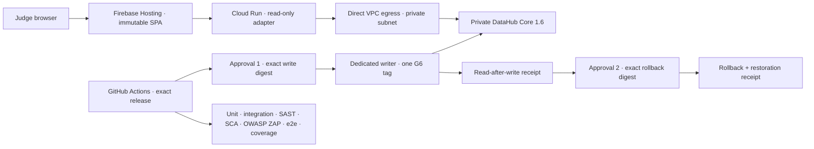

# Archon for DataHub

> **Audit the catalog itself.** Archon is an evidence-first governance agent that finds
> contradictions, lineage gaps, and control violations inside DataHub, explains their
> downstream impact, and permits one narrowly governed remediation only after an exact,
> expiring human approval.

Built for [DataHub: The Agent Hackathon](https://datahub.devpost.com/).

- **Live Demo**: [https://archon-datahub.web.app](https://archon-datahub.web.app) (login-free hosted showcase)
- **Upstream Contribution**: [acryldata/mcp-server-datahub#183](https://github.com/acryldata/mcp-server-datahub/pull/183) (OPEN)
- **Examples & evidence**: [examples/](examples/) (committed evaluation cases and exact reproduction routes)

## Customer quickstart

Connect the read-only API to one authenticated HTTPS DataHub instance, with one exact
dataset query:

```bash
cp quickstart.env.example .env
# edit the three required values, then:
docker compose up --build --detach --wait api
docker compose run --rm doctor
```

The first command does not report success until `/readyz` reaches exactly one live dataset.
The second executes one scoped audit and rejects fixture mode, plaintext customer endpoints,
and a report from a different release. The API binds only to loopback and the Compose stack
contains no mutation route or write credential. See [docs/QUICKSTART.md](docs/QUICKSTART.md).

## Live demo

**https://archon-datahub.web.app**

No login, no account, no credential, no setup. The page loads straight into a completed
integrity pass. The step-by-step judge route is in
[docs/JUDGE_TESTING.md](docs/JUDGE_TESTING.md).

> ### What is deployed, and what is not
>
> **Deployed:** Firebase Hosting serves the React application and proxies its
> allowlisted read routes to `archon-datahub-api` on Cloud Run. The API has no
> write credential and reaches one private DataHub Core 1.6 catalog through
> Cloud Run Direct VPC egress on an allowlisted private subnet. Judges can run the
> bounded live audit without an
> account; the deterministic fixture remains an explicitly labelled fallback.
>
> **Protected proof:** a separate GitHub OIDC identity can execute only the exact
> synthetic G6 plan after a protected-environment approval, prove read-after-write,
> then require a second approval for exact rollback and restoration. This is not a
> public mutation API and no write credential is present in the browser or Cloud Run.
>
> **Not deployed:** the AWS design described later in this README, under
> [Hosted AWS reference architecture](#hosted-aws-reference-architecture). Route 53,
> CloudFront, Cognito, WAF, API Gateway, the Lambdas, Step Functions and the Core sandbox
> are a **reference architecture**. They describe how this would be operated, and the CDK
> for them is in `infra/aws/`, but no AWS environment is running and there is nothing to
> sign in to. Wherever this README describes that stack in the present tense, read it as
> design intent rather than a live system.
>
> **Reproducible:** the same read path can be run against your own DataHub with
> [Run locally](#run-locally-without-external-services) and
> [Connect a real DataHub](#connect-a-real-datahub).

## What Archon does

Most catalog assistants retrieve metadata. Archon tests whether the catalog is internally
consistent:

- **Cross-source contradictions** — retained aspect versions disagree about ownership,
  schema, domain, or deprecation. Archon resolves stable ingestion-source identity from
  DataHub's own ingestion registry and separates it from execution identity (`runId`), so
  two runs of one pipeline never become a fabricated conflict.
- **Lineage gaps and blast radius** — declared current `upstreamLineage` is reconciled
  against resolved MCP topology, and a missing upstream or risky asset is expanded into a
  bounded, cycle-safe downstream impact graph without treating query scope as absence.
- **Governance controls G1–G6** — deterministic checks find missing ownership, domains,
  descriptions, typing, and sensitive-field classification. G6 accepts only exact
  policy identifiers; an unrelated tag or glossary term never passes the control.
- **Evidence, not opaque advice** — every result can be exported as JSON, Markdown, or
  SARIF and carries provenance, policy, and content digests. Model-runtime provenance is
  a strict union: deterministic fixture runs state that no provider model call occurred;
  live runs retain only bounded provider/model/response-ID, token-usage, and client-latency
  metadata. Prompts, credentials, endpoints, raw errors, and provider payloads are never
  admitted to that contract.
- **Governed G6 remediation** — only a missing classification tag can become an action.
  Contradictions and G1–G5 remain manual-only. The browser sends only a decision and
  optional comment; it never sends a tool name, entity URN, or mutation arguments.

### Bounded version-history recovery

A contradiction cannot fire from the MCP read tools alone: those tools ground the current
catalog view, but do not by themselves prove that independent retained sources disagreed.
For this differentiator, live mode directly reads a bounded set of DataHub GMS
`GenericAspectV3` version 0/history records and preserves their system-metadata
provenance. DataHub keeps `systemMetadata.pipelineName` sticky across runs: two independent
ingestion runs, each declaring its own pipeline name, leave both retained versions carrying
the first one, and only `runId` differs. So that field alone cannot establish source
identity. Archon resolves the true source for each `runId` from DataHub's own ingestion
registry, where every `dataHubExecutionRequest` id equals the `runId` stamped on the aspect,
and a resolved mapping outranks `pipelineName`. `pipelineName` stays as a fallback for
history that predates it. Changes from one source are drift; only independent retained
sources can form a contradiction. Missing, unauthorized, malformed, truncated, or
unresolved history fails closed to an unknown/manual result and can never become an
actionable remediation.

The rest of this section describes the AWS reference architecture, not the live demo. It is
the designed hosting boundary, and it is not deployed.

The judge-facing audit APIs are publicly usable only through CloudFront. A generated,
KMS-encrypted origin credential is never delivered to the browser: CloudFront overwrites
`x-api-key`, and API Gateway requires it on every method. The HTTP proxy replaces it with
a static redacted value, while the Lambda custom integrations construct narrow events
that contain no request headers at all. Direct API Gateway bypass therefore fails closed.
The SPA starts the durable path with `POST /api/control-loops` and polls a random
256-bit capability URL; the status projection never exposes a Step Functions ARN,
workflow input/output, task token, identity, or provider error. The legacy
`POST /api/audits` route remains an explicitly synchronous, read-only, one-dataset
diagnostic preview with a 25-second pipeline deadline. A separately deployed worker is
the only component that may
receive a distinct write credential. Its action catalog is limited to the official
`add_tags` / `remove_tags` tools, one entity, one column, and one policy tag.

The environment supplies one exact `DemoQuery` to the SPA, HTTP service, control Lambda,
and public Archon MCP server; a missing scope, padded equivalents, wildcards, alternate
catalog queries, and a query resolving to anything other than one dataset fail closed. MCP
`get_entity` accepts only the URN resolved from that scope and rebuilds a six-field public
identity projection; descriptions, owners, schema fields, tags, glossary terms, domains,
lineage, source metadata, and arbitrary aspects never cross that boundary. Public audit
responses are likewise newly constructed allowlisted projections rather than the immutable
internal evidence object: arbitrary rich detail and raw contradiction values are excluded,
provenance drops actor/value fields, and the complete response is recursively rejected if
it contains forbidden or credential-shaped fields. A shared conformance corpus keeps the
backend, Lambda, browser, evidence exporter, and deployment validator aligned in CI.

## Why DataHub

DataHub is not an application database or object store. It is the metadata context graph
and governance control plane across databases, warehouses, BI, ML, and pipelines.

| Product category | What it owns | Relationship to Archon |
| --- | --- | --- |
| DataHub | Cross-platform metadata graph, lineage, governance, MCP context | Archon audits and safely acts on this control plane |
| AWS Glue / DataZone, Microsoft Purview, Google Dataplex, Alibaba metadata services | Cloud-vendor catalog/governance planes | Alternatives when the estate is concentrated in one cloud |
| CockroachDB | Transactional SQL data | A governed data source, not a catalog substitute |
| Backblaze B2 / S3 | Object storage | Evidence or dataset storage, not a metadata graph |
| Qwen / OpenAI / Gemini | Model inference | Optional narration/reasoning providers, not catalog systems |

The concise positioning is: **DataHub catalogs the data estate; Archon audits the
catalog itself.**

## System design

The active release is deliberately small and low-cost. Public reads and governed writes
use different identities and execution paths; neither path requires Kubernetes or EKS.


```mermaid
flowchart LR
  J["Judge browser"] --> FB["Firebase Hosting · immutable SPA"]
  FB --> API["Cloud Run · read-only adapter"]
  API --> VPC["Direct VPC egress · private subnet"]
  VPC --> DH["Private DataHub Core 1.6"]
  CI["GitHub Actions · exact release"] --> G1["Approval 1 · exact write digest"]
  G1 --> WR["Dedicated writer · one G6 tag"]
  WR --> DH
  WR --> VERIFY["Read-after-write receipt"]
  VERIFY --> G2["Approval 2 · exact rollback digest"]
  G2 --> RESTORE["Rollback + restoration receipt"]
  CI --> TESTS["Unit · integration · SAST · SCA · OWASP ZAP · e2e · coverage"]
```

DataHub Cloud remains a supported runtime profile in the agent-stack contracts, but the
submission does not depend on a trial staying active. The public demo uses the pinned Core
catalog; the historical AWS runtime selector is retained only as a non-deployed reference.

The same flagship flow covers all four challenge technologies:

| DataHub technology | Material use |
| --- | --- |
| MCP Server | Live public bounded reads; protected exact tag write and rollback proof |
| Agent Context Kit | Provenance-bearing envelope exercised in the governed CI journey |
| DataHub Skills | Pinned `search -> lineage -> quality -> audit -> enrich` receipts |
| Analytics Agent | Grounded SQL/chart/context-quality output and proposal-only `/improve-context` |

## Run locally without external services

Node.js 22.15 or newer is recommended.

```bash
npm ci --ignore-scripts
npm run typecheck
npm run build
npm test
npm run coverage
npm run test:security
npm run load
npm run audit:demo
npm start
```

### CI Offline SLO

The GitHub Actions **Offline SLO** job runs the shipped `AuditPipeline.run` and
`audit_catalog` MCP dispatch against the deterministic, network-free Fake DataHub backend.
Its default release gate is explicit and reproducible:

- 10 virtual users execute 200 planned iterations across both entry points;
- the error rate must remain 0%, and completed iterations must equal planned iterations;
- p95 audit latency must stay below 1,500 ms.

`LOAD_VUS`, `LOAD_ITERATIONS`, and `LOAD_P95_MS` are diagnostic overrides; the
release pipeline uses the defaults above and exits non-zero on any breach.

With no DataHub or model credentials, Archon uses deterministic fixtures. This mode is for
development and reproducible CI evidence; the UI labels fallback showcase data rather than
presenting it as a live tenant result.

The React application is an independent locked package:

```bash
npm ci --prefix web --ignore-scripts
npm --prefix web run typecheck
npm --prefix web test
npm --prefix web run test:coverage
npm --prefix web run coverage:critical
npm --prefix web run build
```

Generated `dist/`, `coverage/`, `cdk.out/`, `readiness.json`, dependency directories, and
test reports are ignored and must not be committed.

The ordinary CI web job additionally installs the exact Playwright Chromium revision in
the ephemeral runner, serves the already-built SPA through Vite preview, and exercises the
fixture judge journey on desktop Chrome, Pixel 7, and a 320×568 viewport. The journey keeps
production authentication fail-closed, proves that passive orientation and fixture approval
emit no API or external request, checks keyboard/overflow behavior, and rejects critical or
serious WCAG A/AA Axe findings. Coverage HTML/LCOV/JSON, Playwright HTML, screenshots, traces,
and structured authority/accessibility receipts are retained only as CI artifacts.

## Judge-ready evidence without hand-authored outputs

CI generates three complementary, explicitly labeled evidence products:

- a frozen seven-case DataHub capability benchmark that measures a latest-write-wins
  current-view boundary against Archon's retained-history path, including negative cases
  for same-pipeline drift, unknown provenance, source agreement, and a single write;
- a deterministic synthetic judge pack produced by the real audit, G6 planning, approval,
  execution-verification, receipt, rollback, JSON, Markdown, and SARIF functions; and
- a browser-rendered fixture journey with desktop/mobile screenshots, responsive and
  keyboard checks, Axe evidence, and a zero-mutation-authority request receipt.

These are replayed or contract-checked in CI and retained for 90 days; the benchmark and
synthetic judge-pack artifact digests are checksum-sealed and bound into the default-branch
release attestation.
The browser also offers an on-demand, exactly allowlisted application projection with
WebCrypto self-consistency checks and an optional, passive three-step judge tour. It does
not claim origin authenticity; the attested CI artifact is the external provenance path.
Synthetic packs are never presented as live DataHub or deployment proof.

The primary OSS bonus candidate is a bounded, read-only
[`get_aspect_history` tool](contrib/mcp-get-aspect-history/) for the official DataHub MCP
server. It is submitted upstream as
[acryldata/mcp-server-datahub#183](https://github.com/acryldata/mcp-server-datahub/pull/183).
The maintainer-requested OpenAPI seam, cross-product batch shape, version gate, retention
semantics, response budget, and tests are implemented at head `16d53a5`; source-bound CI
replays the exact upstream commands. Acceptance and re-review timing remain outside entrant
control and are not claimed as completed.

## Connect a real DataHub

Use a sanitized demo tenant and a least-privilege read token.

```bash
DATAHUB_GMS_URL=https://datahub.example.test
DATAHUB_GMS_TOKEN=...
DATAHUB_MCP_URL=https://datahub.example.test/integrations/ai/mcp/
ARCHON_DEMO_QUERY=domain:Commerce
```

`ARCHON_DEMO_QUERY` must already be trimmed, contain no wildcard, and resolve to exactly
one dataset. It is the only query admitted by the public HTTP and Archon MCP catalog tools.

Archon supports two MCP transports:

- **Hosted Streamable HTTP** — set `DATAHUB_MCP_URL`. This is required by the hardened AWS
  container because it intentionally contains no Python/`uvx` runtime.
- **Pinned stdio development path** — leave `DATAHUB_MCP_URL` unset and install `uv`.
  Archon launches the pinned `mcp-server-datahub@0.6.0`, never `@latest`.

Aspect-version contradiction proof additionally requires:

1. retained aspect versions (`v0` plus at least one historical version);
2. two genuinely distinct stable pipeline identities;
3. a planted, sanitized conflict; and
4. the credentialed `Live DataHub proof` GitHub Actions workflow.

The live proof fails on auth, server, network, pagination-bound, retention, or provenance
uncertainty. Only the expected “no next retained version” response terminates history
enumeration normally.

One pipeline run creates one fresh harvest bundle: its snapshot and fact stream derive from
the same narrow search roots. Exact entity hydration, full-schema completion, bidirectional
MCP topology, current declared-lineage reconciliation, and retained history share that URN
set and run under one deadline. Topology neighbors remain context and never expand the
governance/history audit scope. Live search fails before hydration when its declared total
exceeds the execution ceiling; every requested entity must be returned exactly once without
a per-URN error; schema and lineage totals must remain complete and within policy. MCP
`isError` responses are failures, never data. Every aspect history must terminate normally
within its version bound, and a live hosted audit refuses MCP-only configuration without
direct GMS history/current-lineage capability. The public preview
allows one URN and two retained versions with an 18-second harvest deadline. The durable
worker allows at most 25 URNs and 12 retained versions, uses controlled eight-way
concurrency, and has a 75-minute harvest / 90-minute pipeline budget inside its two-hour
callback. A broad request is rejected, never converted into an incomplete actionable plan.

## Governed remediation contract

The versioned policy is [policies/archon-remediation.v1.json](policies/archon-remediation.v1.json).
An actionable result must satisfy all of these conditions:

1. the finding is exactly G6 and has one unambiguous target;
2. the trusted policy allows that dataset prefix and classification tag;
3. dossier, policy, action catalog, before-state, and plan digests verify;
4. an authenticated `DataSteward` approves the exact unexpired plan;
5. the execution journal claims the approval once;
6. a fresh pre-state still matches the approved state;
7. the isolated mutation client invokes the exact official tag tool;
8. read-after-write verification proves the intended postcondition and no unexpected tag;
9. a content-addressed receipt records the event chain and a separately approvable rollback.

Anything ambiguous, stale, unsupported, replayed, or indeterminate fails closed.

## Hosted AWS reference architecture

> **Note on Architecture**: The public demo is hosted at **[https://archon-datahub.web.app](https://archon-datahub.web.app)**. The final judge application release is `7cf2ab063312c2bf06fd2d65c798e802f7070a37`; `/readyz` reports that exact SHA and the hourly availability workflow verifies it. The original `datahub-hackathon-2026-submission` tag remains frozen as historical provenance. Firebase serves the immutable SPA, the read-only Cloud Run adapter reports `ready/live`, and retained CI evidence covers the private DataHub audit, browser journey, and OWASP ZAP DAST. The AWS infrastructure described below in [infra/aws](infra/aws) remains a non-deployed reference architecture for enterprise multi-tenant deployments.

[infra/aws](infra/aws) contains the deployment-grade reference design. The CDK
that creates it is in `infra/aws/` and is built, tested and synthesised in CI, but no
stack has been deployed to any AWS account. There is no hosted endpoint, no Cognito user
pool and no judge credential. Read the present tense here as "would", not "does".

The AWS judge runtime is intentionally lean. It does not require an always-on container
cluster, load balancer, NAT gateway, or Kubernetes control plane.

| Layer | Permanent resources | Cost posture |
| --- | --- | --- |
| Edge | Route 53, ACM, CloudFront OAC, private versioned KMS S3 | Serverless / request based |
| Identity and API | Cognito, regional WAF, API Gateway, six bounded Lambdas | Serverless / request based |
| State and evidence | Two DynamoDB tables, private checkpoint bucket, KMS, SQS and SNS | On-demand / encrypted |
| DataHub Cloud | Reader, governed mutation and fixture-reset image Lambdas | Reserved concurrency bounds; zero when idle |
| DataHub Core | Isolated VPC, Step Functions and a single-host ASG | `min=0`, `desired=0`, `max=1` until a judge launches it |

DataHub Core is built as a pinned, scanned AMI in CI. A session start conditionally claims
the lease, scales the ASG to one, verifies the immutable generation and capability digest,
seeds only the canonical synthetic dataset, and marks the runtime ready. Authenticated
activity extends a 30-minute idle lease up to a two-hour hard limit. Stop, expiry, failure,
or the independent reaper drains work, resets the fixture, and returns desired capacity to
zero. CloudWatch logs are observability evidence, never the lease authority.

The Cloud profile is primary only when the trial bootstrap has sealed valid reader and
writer service-account contracts. The retained reader secret also owns two stable,
independently generated Fernet keys used by Analytics Agent continuity; token rotation
preserves those keys. The writer secret cannot invoke Bedrock and the reader role cannot
read the writer secret or sign mutations.

Deployment is three stacks per stage:

1. `Archon-<stage>-Edge` in `us-east-1` for the certificate and CloudFront WAF.
2. `Archon-<stage>-Core` in `eu-west-1` for the zero-idle OSS runtime.
3. `Archon-<stage>-Judge` in `eu-west-1` for the serverless application and Cloud profile.

## Pipeline-only security and CI/CD

The active release reviews all six Well-Architected pillars and Agentic AI Lens concerns in
[docs/WELL_ARCHITECTED_REVIEW.md](docs/WELL_ARCHITECTED_REVIEW.md), EU AI Act Articles
10/13/14/15/50 in [docs/EU_AI_ACT_REVIEW.md](docs/EU_AI_ACT_REVIEW.md), and GDPR readiness
in [docs/GDPR_REVIEW.md](docs/GDPR_REVIEW.md). These are evidence-backed engineering
reviews, not automatic legal-compliance claims.

Security evidence is produced only by GitHub-hosted CI/CD. No local build, scanner output,
Codex Security result, or mutable image tag is accepted as release evidence.

The promotion chain is build once, verify repeatedly:

1. `ci.yml` runs deterministic tests, SCA, CodeQL-compatible builds, IaC synthesis,
   CloudFormation Guard and Trivy; it emits exact SPA and Lambda subjects.
2. `datahub-cloud-runtime-image.yml` builds one `linux/amd64` image, scans it, emits
   per-release SBOM/provenance evidence and publishes only `URI@sha256`.
3. `datahub-core-ami.yml` resolves and scans every pinned Core image, patches the base OS,
   proves no applicable security updates remain, and seals the AMI receipt.
4. `deploy.yml` accepts exact artifact IDs and GitHub artifact digests, verifies producer
   workflow, source SHA and attestations, revalidates live ECR and AMI identity, and deploys
   staging. Production additionally requires the exact attested staging receipt.
5. The SPA bytes are uploaded only after infrastructure succeeds. Runtime configuration
   contains public OAuth coordinates, never credentials.
6. Scheduled availability and posture workflows re-observe the deployed controls. A
   separate protected workflow proves the exact CloudWatch -> KMS SNS -> KMS SQS alarm
   route and restores the alarm to OK under an unconditional cleanup trap.

Preventive and detective controls include:

- permissions boundaries on every runtime role;
- customer-managed rotating keys, private versioned buckets and DynamoDB PITR;
- digest-only image functions, no Lambda VPC attachment, bounded reserved concurrency,
  active X-Ray and encrypted retained logs;
- CloudFront OAC, modern TLS, WAF on CloudFront, API and Cognito, admin-created judge
  users, PKCE and short token lifetimes;
- exact stream filters for read, mutation and reset workers, bounded retries and encrypted
  failure destinations;
- explicit human approval and local ECDSA verification before the one permitted mutation;
- daily stack drift detection, 30-minute public availability probes and sanitized,
  90-day attested operational receipts.

All workflow intermediates live under `RUNNER_TEMP` on GitHub-hosted runners and are
removed in unconditional cleanup steps. The repository does not require workstation build
artifacts.

## Current delivery status

**What is running today:** https://archon-datahub.web.app serves the exact CI-built React
SPA from Firebase. Its public live-audit control calls a read-only Cloud Run adapter, which
queries one private DataHub Core 1.6 dataset and returns a freshly allowlisted projection.
The deterministic fixture is still available and visibly labelled; it is never represented
as live evidence.

**What is protected rather than public:** the exact G6 write, verification, rollback and
restoration proof. GitHub environments and distinct short-lived OIDC identities keep both
approvals and mutation authority out of the anonymous application.

**What is not deployed:** the entire AWS stack. No CloudFront distribution, no Cognito user
pool, no API Gateway, no Lambdas, no Step Functions, no EC2 sandbox, no DNS. The CDK is
built, tested and synthesised in CI, and that is as far as it has gone. DataHub Cloud trial
credentials, protected-environment variables, the AMI build and production promotion are all
untaken operational steps.

The repository contains the four-component agent path, the low-cost hosted read slice,
the protected governed proof, customer Compose quickstart, and pipeline-only security and
quality evidence. No EKS cluster or always-on managed DataHub deployment is required.

## Prior-work disclosure

This is a new Apache-2.0 project. It reuses selected code patterns from our earlier agents
while adding a new DataHub client/domain layer, temporal provenance semantics, blast-radius
analysis, governed remediation contracts, UI, HTTP boundary, and AWS architecture. The
file-level disclosure is in [NOTICE.md](NOTICE.md).

## License

[Apache License 2.0](LICENSE).
